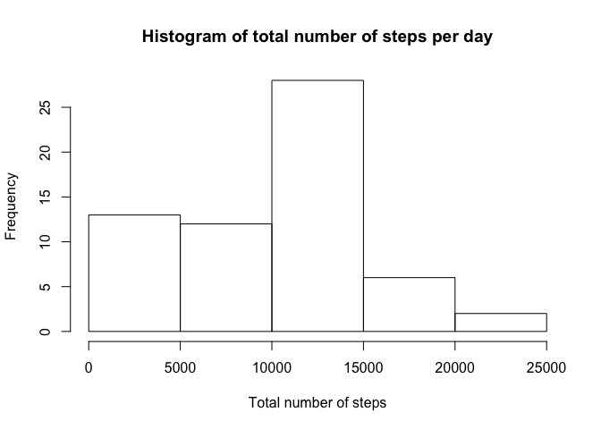
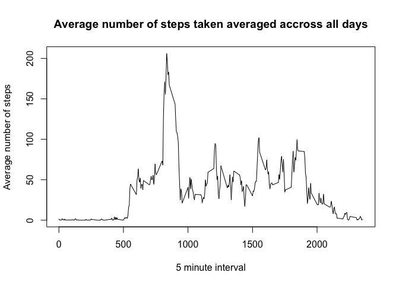
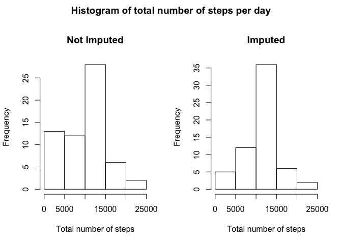
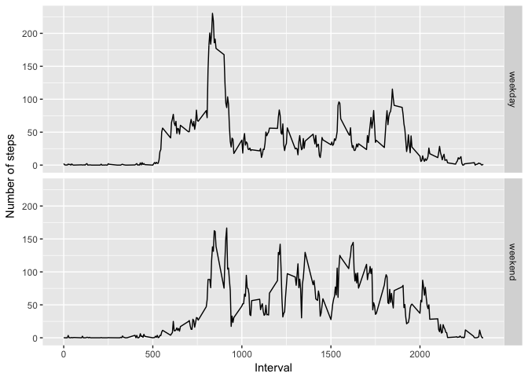

# Reproducible Research: Peer Assessment 1


## Loading and preprocessing the data

1) Load the data
We load the data using read.csv. This assumes that the required activity.csv file is located in your working directory.


```r
activityData <- read.csv('activity.csv', stringsAsFactors = F)
str(activityData)
```

```
## 'data.frame':	17568 obs. of  3 variables:
##  $ steps   : int  NA NA NA NA NA NA NA NA NA NA ...
##  $ date    : chr  "2012-10-01" "2012-10-01" "2012-10-01" "2012-10-01" ...
##  $ interval: int  0 5 10 15 20 25 30 35 40 45 ...
```

2) Process and transform the data into a format suitable for your analysis. Here we create a dplyr data frame with the data


```r
activityData <- tbl_df(activityData)
activityData
```

```
## # A tibble: 17,568 × 3
##    steps       date interval
##    <int>      <chr>    <int>
## 1     NA 2012-10-01        0
## 2     NA 2012-10-01        5
## 3     NA 2012-10-01       10
## 4     NA 2012-10-01       15
## 5     NA 2012-10-01       20
## 6     NA 2012-10-01       25
## 7     NA 2012-10-01       30
## 8     NA 2012-10-01       35
## 9     NA 2012-10-01       40
## 10    NA 2012-10-01       45
## # ... with 17,558 more rows
```

## What is mean total number of steps taken per day?

1) Calculate the total number of steps taken per day


```r
days <- split(activityData, activityData$date)
totals <- lapply(days, function(e) {sum(e$steps, na.rm = T)})
totals <- data.frame(unlist(totals))
totals <- rename(totals, steps = unlist.totals.)
head(totals)
```

```
##            steps
## 2012-10-01     0
## 2012-10-02   126
## 2012-10-03 11352
## 2012-10-04 12116
## 2012-10-05 13294
## 2012-10-06 15420
```

2) If you do not understand the difference between a histogram and a barplot, research the difference between them. Make a histogram of the total number of steps taken each day


```r
hist(totals$steps, main = "Histogram of total number of steps per day", xlab = "Total number of steps")
```

<!-- -->

3) Calculate and report the mean and median of the total number of steps taken per day

**On a per day basis**


```r
days <- split(activityData, activityData$date)
means <- lapply(days, function(e) {mean(e$steps, na.rm = T)})
means <- data.frame(unlist(means))
means <- rename(means, mean = unlist.means.)
medians <- lapply(days, function(e) {median(e$steps, na.rm = T)})
medians <- data.frame(unlist(medians))
medians <- rename(medians, median = unlist.medians.)
join <- cbind(means, medians)
rm(days, means, medians)
head(join)
```

```
##                mean median
## 2012-10-01      NaN     NA
## 2012-10-02  0.43750      0
## 2012-10-03 39.41667      0
## 2012-10-04 42.06944      0
## 2012-10-05 46.15972      0
## 2012-10-06 53.54167      0
```

**Overall mean / median**


```r
print(paste("Daily mean: ", mean(activityData$steps, na.rm = T), ". Daily median: ", median(activityData$steps, na.rm = T), "."))
```

```
## [1] "Daily mean:  37.3825995807128 . Daily median:  0 ."
```

## What is the average daily activity pattern?

1) Make a time series plot (i.e. 𝚝𝚢𝚙𝚎 = "𝚕") of the 5-minute interval (x-axis) and the average number of steps taken, averaged across all days (y-axis)


```r
minutes <- split(activityData, activityData$interval)
means <- lapply(minutes, function(e) {mean(e$steps, na.rm = T)})
means <- data.frame(unlist(means))
means <- rename(means, steps = unlist.means.)
rm(minutes)
plot(rownames(means), means$steps, type = 'l', main = "Average number of steps taken averaged accross all days", xlab = "5 minute interval", ylab = "Average number of steps")
```

<!-- -->

2) Which 5-minute interval, on average across all the days in the dataset, contains the maximum number of steps?


```r
means$interval = as.numeric(rownames(means))
filter(means, steps == max(means$steps))
```

```
##      steps interval
## 1 206.1698      835
```

## Imputing missing values

Note that there are a number of days/intervals where there are missing values (coded as 𝙽𝙰). The presence of missing days may introduce bias into some calculations or summaries of the data.

1) Calculate and report the total number of missing values in the dataset (i.e. the total number of rows with 𝙽𝙰s)


```r
count(activityData[is.na(activityData$steps),])
```

```
## # A tibble: 1 × 1
##       n
##   <int>
## 1  2304
```

2) Devise a strategy for filling in all of the missing values in the dataset. The strategy does not need to be sophisticated. For example, you could use the mean/median for that day, or the mean for that 5-minute interval, etc.

*Here we use the mean for that interval*


```r
fullActivityData <- activityData
fullActivityData$fullSteps <- apply(activityData, 1, function(e) {
  if (is.na(e['steps'])) {
    e['steps'] <- round(means[means$interval == as.numeric(e['interval']), ]$steps)
  }
  return(as.numeric(e['steps']))
})
head(fullActivityData)
```

```
## # A tibble: 6 × 4
##   steps       date interval fullSteps
##   <int>      <chr>    <int>     <dbl>
## 1    NA 2012-10-01        0         2
## 2    NA 2012-10-01        5         0
## 3    NA 2012-10-01       10         0
## 4    NA 2012-10-01       15         0
## 5    NA 2012-10-01       20         0
## 6    NA 2012-10-01       25         2
```

3) Create a new dataset that is equal to the original dataset but with the missing data filled in.


```r
fullActivityData <- select(fullActivityData, date, interval, fullSteps)
fullActivityData <- rename(fullActivityData, steps = fullSteps)
head(fullActivityData)
```

```
## # A tibble: 6 × 3
##         date interval steps
##        <chr>    <int> <dbl>
## 1 2012-10-01        0     2
## 2 2012-10-01        5     0
## 3 2012-10-01       10     0
## 4 2012-10-01       15     0
## 5 2012-10-01       20     0
## 6 2012-10-01       25     2
```

4) Make a histogram of the total number of steps taken each day and Calculate and report the mean and median total number of steps taken per day. Do these values differ from the estimates from the first part of the assignment? What is the impact of imputing missing data on the estimates of the total daily number of steps?


```r
days <- split(fullActivityData, fullActivityData$date)
fullTotals <- lapply(days, function(e) {sum(e$steps, na.rm = T)})
rm(days)
fullTotals <- data.frame(unlist(fullTotals))
fullTotals <- rename(fullTotals, steps = unlist.fullTotals.)
par(mfrow=c(1,2), oma=c(0,0,2,0))
hist(totals$steps, main = "Not Imputed", xlab = "Total number of steps")
hist(fullTotals$steps, main = "Imputed", xlab = "Total number of steps")
title("Histogram of total number of steps per day", outer=TRUE)
```

<!-- -->


```r
days <- split(fullActivityData, fullActivityData$date)
fullMeans <- lapply(days, function(e) {mean(e$steps, na.rm = T)})
fullMeans <- data.frame(unlist(fullMeans))
fullMeans <- rename(fullMeans, mean = unlist.fullMeans.)
fullMedians <- lapply(days, function(e) {median(e$steps, na.rm = T)})
fullMedians <- data.frame(unlist(fullMedians))
fullMedians <- rename(fullMedians, median = unlist.fullMedians.)
fullJoin <- cbind(fullMeans, fullMedians)
rm(days, fullMeans, fullMedians)
head(fullJoin)
```

```
##                mean median
## 2012-10-01 37.36806   34.5
## 2012-10-02  0.43750    0.0
## 2012-10-03 39.41667    0.0
## 2012-10-04 42.06944    0.0
## 2012-10-05 46.15972    0.0
## 2012-10-06 53.54167    0.0
```

**Overall mean / median**


```r
print(paste("Daily mean: ", mean(fullActivityData$steps, na.rm = T), ". Daily median: ", median(fullActivityData$steps, na.rm = T), "."))
```

```
## [1] "Daily mean:  37.3806921675774 . Daily median:  0 ."
```

The overall mean steps has been slightly reduced due to the previous NA values being replaced with the mean values accross all days for that interval. The values used to replace the NA values must be slightly below the overall daily mean.

## Are there differences in activity patterns between weekdays and weekends?

For this part the 𝚠𝚎𝚎𝚔𝚍𝚊𝚢𝚜() function may be of some help here. Use the dataset with the filled-in missing values for this part.

1) Create a new factor variable in the dataset with two levels – “weekday” and “weekend” indicating whether a given date is a weekday or weekend day.


```r
fullActivityData$weekday <- apply(fullActivityData, 1, function(e) {
  if (weekdays(as.Date(e['date'])) == "Saturday" | weekdays(as.Date(e['date'])) == "Sunday") {
    e['weekday'] <- 'weekend'
  } else {
    e['weekday'] <- 'weekday'
  }
  return(as.factor(e['weekday']))
})
head(fullActivityData)
```

```
## # A tibble: 6 × 4
##         date interval steps weekday
##        <chr>    <int> <dbl>  <fctr>
## 1 2012-10-01        0     2 weekday
## 2 2012-10-01        5     0 weekday
## 3 2012-10-01       10     0 weekday
## 4 2012-10-01       15     0 weekday
## 5 2012-10-01       20     0 weekday
## 6 2012-10-01       25     2 weekday
```

2) Make a panel plot containing a time series plot (i.e. 𝚝𝚢𝚙𝚎 = "𝚕") of the 5-minute interval (x-axis) and the average number of steps taken, averaged across all weekday days or weekend days (y-axis). See the README file in the GitHub repository to see an example of what this plot should look like using simulated data.

**From the github page: Note that the above plot was made using the lattice system but you can make the same version of the plot using any plotting system you choose.**


```r
library("ggplot2")

minutes <- split(fullActivityData, paste(fullActivityData$interval, fullActivityData$weekday))
means <- lapply(minutes, function(e) {mean(e$steps, na.rm = T)})
means <- data.frame(unlist(means))
means <- rename(means, steps = unlist.means.)
means$weekday <- ifelse (grepl('weekend', rownames(means)), 'weekend', 'weekday')
means$interval <- as.numeric(gsub("[^0-9]", "", rownames(means)))

ggplot(data = means, aes(x=interval, y=steps))+geom_line()+facet_grid(weekday~.)+xlab("Interval")+ylab("Number of steps")
```

<!-- -->

